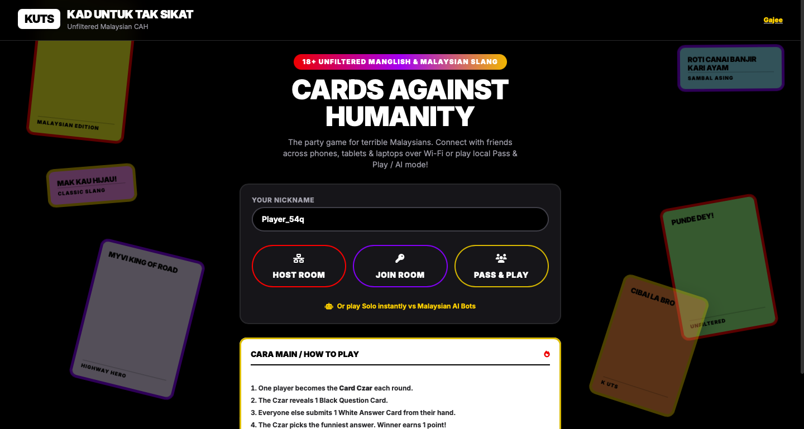
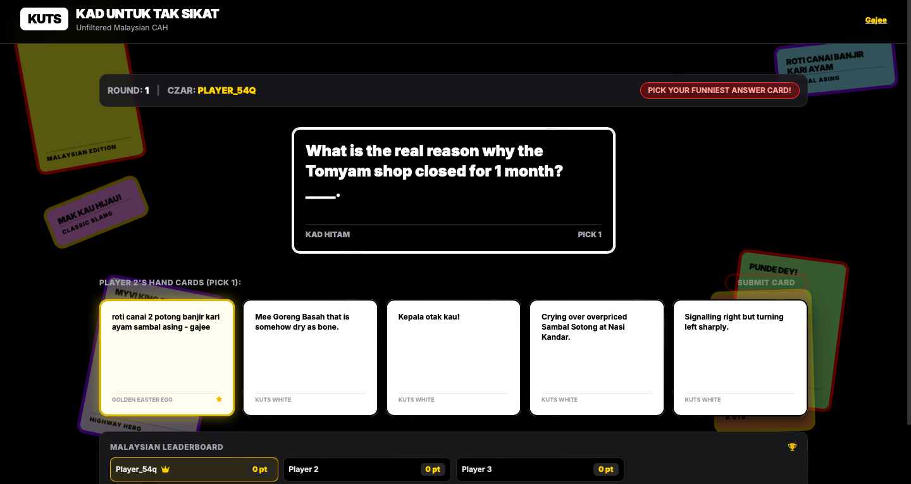

# Kad Untuk Tak Sikat 🇲🇾

**Unfiltered Malaysian Cards Against Humanity — the party game for terrible Malaysians.**

A single-file, browser-based, P2P multiplayer party game inspired by Cards Against Humanity, remixed with unfiltered Manglish and Malaysian slang. No server, no install — just open the page and start playing with friends over Wi-Fi, or solo against AI bots.

> ⚠️ **18+ Content Warning:** This game contains unfiltered, adult Malaysian slang and humor. Not for the faint of hati.

## Screenshots

| Lobby | In-Game |
|---|---|
|  |  |

## Features

- 🌐 **True P2P Multiplayer** — powered by [PeerJS](https://peerjs.com/) (WebRTC), no backend server required.
- 🏠 **Host / Join Rooms** — spin up a room with a shareable 4-letter code, or join a friend's room instantly.
- 🔁 **Pass & Play** — one device, multiple players, passed around the table.
- 🤖 **Solo vs AI Bots** — play instantly against Malaysian AI bots, or fill empty seats in a multiplayer room with bots.
- 👑 **Card Czar Rotation** — classic CAH judging loop: reveal a black card, submit white cards, Czar picks the winner.
- 🎯 **Configurable Target Score** — first to 5, 8, or 12 points wins, or go Endless with no score cap.
- 🌟 **Golden Easter Egg Cards** — rare specialty cards get a distinct gold-foil card style.
- 🎨 **Custom CAH-Styled UI** — physical card look and feel, built with Tailwind CSS and FontAwesome icons.

## How to Play

1. Enter a nickname and either **Host Room**, **Join Room**, **Pass & Play**, or play **Solo vs AI Bots**.
2. Each round, one player becomes the **Card Czar** and reveals a black question card.
3. Everyone else submits their funniest white answer card from their hand.
4. The Czar picks the best answer — the winner earns 1 point.
5. First to reach the **Target Score** wins the game (or keep going forever in Endless mode).

## Tech Stack

- **HTML / CSS / JavaScript** — single self-contained file, no build step
- **[Tailwind CSS](https://tailwindcss.com/)** (via CDN) — styling
- **[PeerJS](https://peerjs.com/)** — WebRTC peer-to-peer multiplayer networking
- **[Font Awesome](https://fontawesome.com/)** — icons

## Running Locally

No build tools or dependencies to install — it's a single HTML file.

```bash
git clone https://github.com/<your-username>/<your-repo>.git
cd <your-repo>
```

Then simply open `index.html` in your browser, or serve it locally:

```bash
python3 -m http.server 8000
```

Visit `http://localhost:8000` in your browser.

## Multiplayer Notes

Since multiplayer uses WebRTC (PeerJS) for direct peer-to-peer connections, all players need a stable internet connection and, in some network setups (strict corporate/school firewalls), may need to be on the same network or a network that allows WebRTC traffic.

## Credits

Made by [Gajee Hub](https://gajeee.github.io/Portfolio/)

## License

All Rights Reserved © 2026 Gajee. This is proprietary — no copying, forking, redistributing, or reselling without permission. See [LICENSE](LICENSE) for details.
